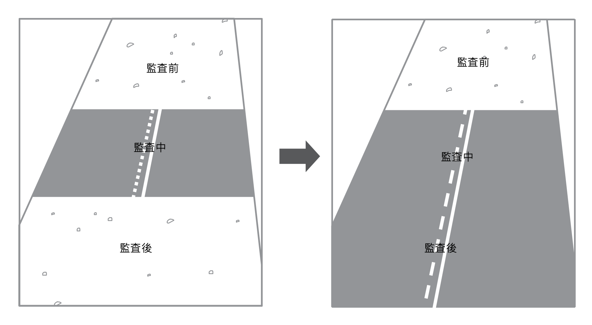
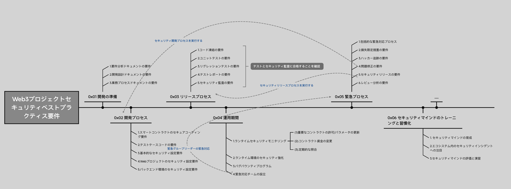

# Web3プロジェクトのセキュリティベストプラクティス要件 v0.1

[English Version](./README.md), 
[中文版本](./README_zh_CN.md) 

[@JackJia2021](https://x.com/jackjia2021/), さんによる日本語版の記事の専門的な翻訳に心より感謝申し上げます。
## 0x00 概要

現在、Web3プロジェクトは多岐にわたる攻撃手法にさらされており、プロジェクト間のインタラクションもますます複雑化している。このような状況下では、新たなセキュリティ問題が頻繁に発生している。しかし、多くのWeb3プロジェクトの開発チームは、セキュリティに関する最前線の経験が不足していることが一般的である。また、Web3プロジェクトの開発では、プロジェクト全体のビジネス検証や機能の実装に重点が置かれているため、セキュリティシステムの構築に十分なリソースを割くことができていない。そのため、セキュリティシステムが欠如している状態では、Web3プロジェクトの全ライフサイクルにわたる安全性を確保することが困難である。

通常、プロジェクトチームはWeb3プロジェクトのセキュリティを確保するために、優秀なブロックチェーンセキュリティチームを雇い、コードのセキュリティ監査を行い。セキュリティ監査を実施することで、さまざまなセキュリティベストプラクティスをより効果的に実現できるが、ブロックチェーンセキュリティチームによる監査は短期的なサポートに過ぎず、プロジェクトチームが独自のセキュリティシステムを構築することにはつながらない。

そのため、SlowMistセキュリティチームは、Web3プロジェクトのセキュリティベストプラクティス要件をオープンソース化し、ブロックチェーンエコシステム内のプロジェクトチームが関連するWeb3プロジェクトのセキュリティスキルを習得できるよう、継続的に支援している。これにより、プロジェクトチームがこのセキュリティベストプラクティス要件に基づいて独自のセキュリティシステムを構築・改善し、監査後も一定のセキュリティ能力を維持できることを目指している。

Web3プロジェクトのセキュリティベストプラクティス要件には、以下の内容が含まれている。現在のバージョンはv0.1で、今後も継続的に改善を行っていく。ご提案がありましたら、ぜひフィードバックをお寄せください。

サポートが必要な場合は、team@slowmist.com または sec_audit@slowmist.com までご連絡ください。

## 0x01 開発の準備

### 1.要件分析ドキュメントの要件

- プロジェクトの詳細な説明を含める;
- プロジェクトが解決する問題を含める;
- セキュリティおよびプライバシーリスクの評価を含める。

### 2.開発設計ドキュメントの要件

- プロジェクトのアーキテクチャ設計図を含める;
- コード内の各関数の機能説明を含める;
- コード内のスマートコントラクト間の関連性を説明する内容を含める;
- セキュリティおよびプライバシー要件が正しく実現されている。

### 3.業務プロセスドキュメントの要件

- プロジェクト内の各業務プロセスの説明を含める;
- 詳細な業務プロセス図を含める;
- 詳細な資金フロー図を含める。

## 0x02 開発プロセス

### 1.スマートコントラクトのセキュアコーディング要件

- 可能な限り、OpenZeppelinなどの有名なライブラリ(library)を利用して開発する;
- SafeMathやバージョン0.8.xのコンパイラを使用して、大部分のオーバーフロー問題を回避する;
- 関数の命名規則に従う（参考: [solidity style guide](https://docs.soliditylang.org/en/v0.8.14/style-guide.html)）;
- 関数および変数の可視性を明示的に宣言する;
- 関数の戻り値を明示的に代入する;
- 関数の機能およびパラメータの注釈を完備する;
- 外部呼び出し（例: transfer、transferFrom、send、call、delegatecallなど）の戻り値を正しくチェックする;
- インターフェース(interface)のパラメータや戻り値の実装が正しい;
- スマートコントラクトの重要なパラメータを設定する際、権限認証を行い、イベントを使用して記録する;
- アップグレード可能なモデルにおいて、新しい実装スマートコントラクトのデータ構造が、古い実装スマートコントラクトのデータ構造と互換性がある;
- コード内の算術演算に関して、精度の問題を十分に考慮し、除算後の乗算による精度損失を回避する;
- callなどのlow level呼び出しのターゲットアドレスと関数が予想通りである;
- callなどのlow level呼び出しを使用する際、業務ニーズに応じてGasを制限する;
- コーディング規約に従い、以下の順序で実装する: 先に確認、次に変数への書き込み、その後に外部呼び出し（Checks-Effects-Interactions）;
- 業務上のインタラクションにおいて、外部スマートコントラクトが互いに互換性がある（例: デフレ/インフレ型トークン、ERC-777、ERC-677、ERC-721などのリエントラント（再入可能）なトークン）;（参考：[再入攻撃の事例](https://medium.com/amber-group/preventing-re-entrancy-attacks-lessons-from-history-c2d96480fac3)）;
- 外部呼び出しにおいて、再入リスクを十分に考慮する;
- スマートコントラクトのstorage変数への大量のループによる書き込み/読み取りを避けること;
- 特にスマートコントラクトの重要なパラメータの変更に関する権限について、権限が過度に集中しないようにし、権限分離を行い、ガバナンス、タイムロックスマートコントラクト、またはマルチシグスマートコントラクトを使用して管理する;
- スマートコントラクトの継承関係を線形に保ち、ビジネス上必要な場合のみ継承を行う;
- チェーン上のブロックデータをランダム数のシードとして使用しないようにすること;
- ランダム数の取得と使用において、ロールバック攻撃の可能性を十分に考慮する;
- ChainlinkのVRFを使用して信頼性の高いランダム数を取得することを推奨（参考: [Chainlink VRF](https://docs.chain.link/docs/chainlink-vrf/)）;
- 第三者のスマートコントラクトのトークン数量を直接使用してLPトークン価格を計算しない（参考: [LP価格の正しい取得方法](https://blog.alphafinance.io/fair-lp-token-pricing/)）;
- 第三者のスマートコントラクトを通じて価格を取得する際、単一の価格ソースに依存しないようにし、少なくとも3つの価格ソースを使用することを推奨;
- 重要な業務プロセスにおいて、プロジェクト実行時のデータ分析のためにイベントを使用して状態を記録する;
- グローバルおよびコアビジネスの緊急停止スイッチを用意し、ブラックスワンイベント発生時に迅速に損失を止めることができるようにすること。

### 2.テストケースコードの要件

- 業務プロセス/関数機能の可用性テストを含める;
- ユニットテストのカバレッジが95%以上、コアコードのカバレッジが100%に達する。

### 3. テストケースコードの要件

- 有効なCI/CDパイプラインを使用することを確認してください（参考：[CI/CD Pipeline for Smart Contracts](https://docs.tenderly.co/forks/guides/ci-cd-pipeline-for-smart-contracts)）;
- 公式メールにはGmailなどの有名なサービスプロバイダーを使用する;
- 公式メールアカウントでMFA機能を強制的に有効にする;
- 有名なドメインサービスプロバイダー（例: GoDaddy）を使用する;
- ドメインサービスプロバイダーのプラットフォームでアカウントにMFAセキュリティ設定を有効にする;
- AkamaiやCloudflareなどの優れたCDNサービスプロバイダーを使用する;
- DNS設定でDNSSecを有効にし、ドメインサービス管理プラットフォームで管理アカウントに強力なパスワードを設定し、MFA認証を有効にする;
- DNSリゾルバにおいて、GoDaddy、NameSilo、NameCheapなどの優れたドメインサービスプロバイダーを使用する;
- ドメインのプライバシー保護を有効にする;
- すべてのメンバーのスマートフォンおよびコンピュータにウイルス対策ソフトを使用する（例: AVGなど）。

### 4. Webフロントエンドのセキュリティ設定要件

- 全サイトのHTTP通信がHTTPSを使用する;
- HSTSを設定し、中間者攻撃（例: DNSハイジャック、BGPハイジャック）を防ぐ（参考: [HSTS設定ガイド](https://developer.mozilla.org/en-US/docs/Web/HTTP/Headers/Strict-Transport-Security)）;
- X-FRAME-OPTIONSを設定し、Clickjacking攻撃を防ぐ（参考: [X-FRAME-OPTIONS設定ガイド](https://developer.mozilla.org/en-US/docs/Web/HTTP/Headers/X-Frame-Options)）;
- X-Content-Type-Optionsを設定し、ブラウザのスニッフ(sniff)行為によるリスクを対策する（参考: [X-Content-Type-Options設定ガイド](https://developer.mozilla.org/en-US/docs/Web/HTTP/Headers/X-Content-Type-Options)）;
- CSPポリシーを設定し、XSS攻撃を防ぐ（参考: [CSPコンテンツセキュリティポリシーガイド](https://developer.mozilla.org/en-US/docs/Web/HTTP/CSP)）;
- 権限およびユーザー認証情報に関連するCookieに、HttpOnly、Secure、Expires、SameSiteフラグを設定する（参考: [Cookie設定ガイド](https://developer.mozilla.org/en-US/docs/Web/HTTP/Cookies)）;
- 異なる業務のサブドメインを厳密に分離し、サブドメインのXSS問題が互いに影響しないようにする;
- 参照するサードパーティリソースにintegrity属性を使用して制限をかけ、第三者がハッキングされた場合でもプロジェクトのサイトが影響を受けないようにする（参考: [SRI設定ガイド](https://developer.mozilla.org/en-US/docs/Web/Security/Subresource_Integrity)）;
- CORSを正しく設定し、指定されたオリジン(origin)ドメイン、プロトコル、およびポートだけがプロジェクトのリソースにアクセスできるようにする（参考: [CORS設定ガイド](https://developer.mozilla.org/en-US/docs/Web/HTTP/CORS)）;
- 業務で実装されたaddEventListener/postMessageにおいて、メッセージのオリジンとターゲットを確認する（参考: [postMessageセキュリティガイド](https://developer.mozilla.org/zh-CN/docs/Web/API/Window/postMessage)）;

### 5. バックエンド環境のセキュリティ設定要件

- サーバーログ、ウェブアクセスログ、データベース操作ログ、ミドルウェアログを有効にし、一元的に収集および管理するためにsplunkのソリューションを使用できるようにしてください;
- プロジェクトのサーバーがネットワークアクセス制限を適切に設定し、IPホワイトリストアドレスとネットワークセグメントの分割を通じて、プロジェクトのネットワークアーキテクチャを最適化および標準化し、業務上必要なサーバー間のみのネットワーク通信を許可するようにしてください;
- AWS、Google Cloudなどの優れたクラウドサーバープロバイダーを選択する;
- プロジェクトに使用するクラウドプラットフォームの管理アカウントに強力なパスワードを設定し、MFA認証を有効にする;
- プロジェクトコードをサーバーにデプロイする前に、サーバーをセキュリティ強化する（例: HIDSのインストール、SSHキーを使用したログイン、SSHログインアラートの設定、SSHログインのGoogle認証設定など）;
- 専門のソフトウェアモニタリングサービスとサーバーの可用性を使用する（例: APM、Zabbixなど）;
- SlowMist、Trail of Bitsなどの専門機関によって、定期的にプロジェクトのセキュリティテストを実施する。

## 0x03 リリースプロセス

- 完備なセキュリティに基づくリリースプロセスを確立するために、以下の内容を参考に詳細化することができます。

### 1. コード凍結の要件

- 予定されたリリース日から逆算して2日前にコードを凍結し、それ以降は一切のコード変更を行わない。

### 2. ユニットテストの要件

- ユニットテストのカバレッジ率が95%以上である。コアコードのカバレッジ率は100%を達成する。また、ユニットテストのカバレッジレポートを出力する。

### 3.リグレッションテストの要件

- リリース1日前に単体テストを実行し、リグレッションテストを行う。

### 4.テストレポートの要件

- リリース前の半日前に、開発チームおよびテストチームが共同でテストレポートを完成させる。テストに合格しない場合（ユニットテストおよびリグレッションテストを含む）は、リリースを延期し、修正が完了した後に再度コード凍結段階に戻る（つまり、少なくとも2日間の延期が必要となる）。

### 5.セキュリティ監査の要件

- 内部セキュリティチームを育成し、新しいコードが追加されるたびに内部セキュリティチームによるコードレビューを受けさせると同時に、内部セキュリティチームの能力を継続的に向上および育成してください。参考[《SlowMist-Learning-Roadmap-for-Becoming-a-Smart-Contract-Auditor》](https://github.com/slowmist/SlowMist-Learning-Roadmap-for-Becoming-a-Smart-Contract-Auditor)。
- コードが凍結された後に、セキュリティ監査チームが全体的なセキュリティリグレッションを行う。いかなる脆弱性やセキュリティリスク（重大、高リスク、中リスク）が発見された場合も、リリースを延期し、修正が完了した後に再度コード凍結段階に戻る（つまり、少なくとも2日間の延期が必要となる）。
- セキュリティ監査には、少なくとも3つのチームが独立して監査を行う（1つの内部チームと2つの外部チームの参加が望ましい）。

## 0x04 ランタイムセキュリティモニタリング

### 1.ランタイムセキュリティモニタリング

- プロジェクトが使用しているNetlifyまたはVercelで、監査ログまたはモニタリングを有効にする;
- DNS変更のモニタリングを設定する。[Better Stack](https://betterstack.com/docs/uptime/uptime-monitor/)などの商用ソリューションを使用することを推奨する。

プロジェクトのランタイム中に、以下のような重要な業務プロセスで発生するイベントを通じてセキュリティ問題を早期に発見することが重要である:
- スマートコントラクトの重要な権限/パラメータの変更: 管理ロールの変更イベントや、管理ロールによるスマートコントラクトの重要パラメータの変更イベントをモニタリングし、秘密鍵の盗難の可能性を早期に発見すること;
- スマートコントラクトの資金変動: 価格変動およびスマートコントラクトの資金変動の状況をモニタリングし、フラッシュローン攻撃などの可能性を早期に発見すること;
- 定期的な対照: チェーン上のイベントおよび取引を定期的に対照し、業務ロジック上の問題を早期に発見すること。

### 2.ランタイム環境のセキュリティ強化

- フロントエンドコードが配置されるサーバーのセキュリティ強化を確実に行うこと（例: [HIDSのインストール](https://www.aliyun.com/product/aegis)、[SSHキーを使用したログイン、SSHログインアラートの設定](https://medium.com/@alessandrocuda/ssh-login-alerts-with-sendmail-and-pam-3ef53aca1381)、[SSHログインにおけるgoogle-authの設定](https://goteleport.com/blog/ssh-2fa-tutorial/)など）;
- DNS設定においてDNS Secを有効にし、ドメインサービス管理プラットフォームで管理アカウントに強力なパスワードを設定し、MFAを有効にする;
- プロジェクトが使用するクラウドプラットフォームの管理アカウントに強力なパスワードを設定し、MFAを有効にする;
- DNS解析などの操作において、MFAが有効になっていることを確認してください。

### 3.バグバウンティプログラムの発表

- バグバウンティプログラムを発表するか、著名なバグバウンティプラットフォームに参加し、コミュニティのホワイトハットによるプロジェクトの保護を促進することを推奨する。[BugRap](https://bugrap.io/)、[code4rena](https://code4rena.com/)、[immunefi](https://immunefi.com/)などを選択することができる。

### 4.緊急対応チームの設立

- 緊急対応チームを設立し、外部に連絡先を提供する。このチームは、ホワイトハットが発見した問題に対応したり、ブラックスワンイベントが発生した際にチームメンバーをリードして緊急対応を行う責任を負う。

## 0x05 緊急プロセス

### 1.包括的な緊急対応プロセス

- 可能な限り包括的な緊急対応プロセスを策定し、緊急対応プロセスに従ってブラックスワンイベントを順番にて処理する;
- 定期的にセキュリティ緊急対応演習を実施し、プロセスを改善してセキュリティインシデントに正確かつ迅速に対応できるようにする（例: [SEAL Drills](https://twitter.com/samczsun/status/1717243519243636755)）。

### 2.損失限定処置の要件

- 問題の影響範囲と危害の程度に応じて、緊急停止スイッチを使用して迅速に損失を最小限に抑える;
- ブラックスワンイベントの発生した際には、コミュニティメンバーに通知し、ユーザーがプロジェクトとのインタラクションを続けて損失を被ることを避ける。

### 3.ハッカー追跡の要件

- ハッカーが利益を得たアドレスを迅速に分析し、PC、Web、サーバーのアクセスログを保管する（マルウェアがある場合は、そのファイルも保管すること）;
- サーバーのスナップショットを作成し、ハッキングの現場を迅速に保全する;
- 専門のセキュリティチームに連絡し、追跡支援を依頼する（例: [MistTrack追跡分析プラットフォーム](https://misttrack.io/)、[Chainalysis](https://www.chainalysis.com/)）。

### 4.問題修正の要件

- 専門のセキュリティチームと協議し、問題に対する最適な修正策を決定する;
- 修正策を正確に実施し、専門のセキュリティチームによる検証を受ける。

### 5.セキュリティリリースの要件

- リリースプロセスの要件を遵守し、すべてのコード変更がテストおよびセキュリティ監査を受けた。

### 6.レビュー分析の要件

- •監査報告書を公開し、コミュニティメンバーと修正策および救済措置を共有する;
- •監査報告書には、問題の根本原因、影響範囲、具体的な損失、問題の修正状況、ハッカーの追跡状況などの関連進捗を含める。

## 0x06 セキュリティマインドのトレーニングと習慣化

### 1.セキュリティマインドの育成

- チームメンバーは[ブロックチェーンのダークフォレストにおける自己防衛のためのハンドブック](https://darkhandbook.io/)を丁寧かつ詳細に読み、関連するセキュリティ意識を育成してください;
- オンラインのセキュリティマインドテストサイトを利用してトレーニングやクイズを実施できる。例：[Google's Phishing Quiz](https://phishingquiz.withgoogle.com/)，[Phishing.org](https://www.phishing.org/phishing-resources);
- 同時に、チーム管理にセキュリティマインドのトレーニングと評価のプロセスを組み込むべきである。例えば、新入社員は入社時にセキュリティマインドのトレーニングとテストを受け、IT専門職の場合はコード開発やシステム運用などの観点からもセキュリティマインドのトレーニングと評価を行う必要がある;
- さらに、定期的にセキュリティマインドトレーニングを開催し、最近のハッカーの新たな攻撃方法や関連するセキュリティインシデントをチームに共有してください。

### 2.エコシステム内のセキュリティインシデントへの注目

- [ScamSniffer](https://x.com/realScamSniffer)rや[Wallet Guard](https://x.com/wallet_guard)など、Crypto Anti-Scamに特化したチームの動向を注視し、現在流行しているフィッシング攻撃の手口を理解してください;
- コミュニティやエコシステム内のセキュリティインシデントに注目し、それらを整理してチームメンバーに同期してください。

### 3.セキュリティマインドの評価と演習

- チームメンバーのセキュリティマインドを定期的に評価し、優れたサイバーセキュリティ企業と協力して関連するセキュリティ演習を実施してください;
- ハッカーの攻撃方法をシミュレーションし、フィッシングやマルウェアを仕掛ける形でチームメンバーのセキュリティマインドをテストできる。これにより、チームメンバーのデバイス上のエンドポイントセキュリティシステムの検知能力も検証できる。