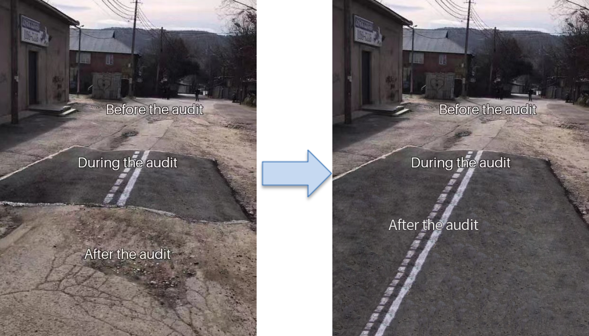
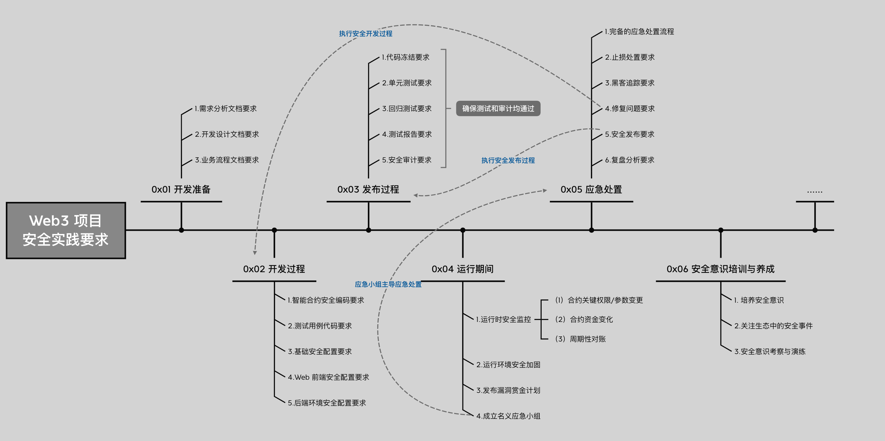

# Web3 项目安全实践要求 v0.1
[English Version](./README.md)
## 0x00 背景概述

现今针对 Web3 项目的攻击手法层出不穷，且项目之间的交互也越发复杂，在各个项目之间的交互经常会引入新的安全问题，而大部分 Web3 项目研发团队普遍缺少的一线的安全攻防经验，并且在进行 Web3 项目研发的时候重点关注的是项目整体的商业论证以及业务功能的实现，而没有更多的精力完成安全体系的建设，因此在缺失安全体系的情况下很难保证 Web3 项目在整个生命周期的安全性。

通常项目方团队为了确保 Web3 项目的安全会聘请优秀的区块链安全团队对其代码进行安全审计，在进行安全审计的时候，才能够更好地实现各种安全实践要求，但是区块链安全团队的审计仅仅是短期的引导，并不能让项目方团队建立属于自己的安全体系。

因此慢雾安全团队开源了`Web3 项目安全实践要求`来持续性帮助区块链生态中的项目方团队掌握相应的 Web3 项目的安全技能，希望项目方团队能够基于`Web3 项目安全实践要求`建立和完善属于自己的安全体系，在审计之后也能具备一定的安全能力。

`Web3 项目安全实践要求`将包含如下的内容，目前属于 v0.1 版本，并且还在持续的完善，如果你有更好的建议欢迎提交反馈。（如果你需要帮助请联系 `team@slowmist.com`，`sec_audit@slowmist.com`）

## 0x01 开发准备

### 1.需求分析文档要求

- 确保包含项目的详尽描述;
- 确保包含项目解决的问题;
- 确保包含安全/隐私风险评估;

### 2.开发设计文档要求

- 确保包含项目的架构设计图;
- 确保包含代码中函数的功能描述;
- 确保包含代码中合约之间的关联关系描述;
- 确保安全/隐私的要求被正确实施;

### 3.业务流程文档要求

- 确保包含项目中每个业务流程的描述;
- 确保包含详尽的业务流程图;
- 确保包含详尽的资金链路图;

## 0x02 开发过程

### 1.智能合约安全编码要求

- 确保包含尽可能基于 OpenZeppelin  等知名 library 进行开发；
- 确保包含使用 SafeMath 或 0.8.x 的编译器来避免绝大部分溢出问题；
- 确保遵循函数命名规范，参考: [solidity style guide](https://docs.soliditylang.org/en/v0.8.14/style-guide.html)；
- 确保函数和变量可见性采用显性声明；
- 确保函数返回值被显性赋值；
- 确保函数功能和参数注释完备；
- 确保外部调用正确检查返回值，包含：transfer，transferFrom，send，call，delegatecall等；
- 确保 interface 的参数类型返回值等实现是正确的；
- 确保设置合约关键参数时有进行鉴权并使用事件进行记录；
- 确保可升级模型的新的实现合约的数据结构与旧的实现合约的数据结构是兼容的；
- 确保代码中涉及算数运算的逻辑充分考虑到精度问题，避免先除后乘导致可能的精度丢失的问题；
- 确保 call 等 low level 调用的目标地址和函数是预期内的；
- 使用 call 等 low level 调用的时候要根据业务需要限制 Gas；
- 编码规范进行约束，遵循：先判断，后写入变量，再进行外部调用(Checks-Effects-Interactions)；
- 确保业务上交互的外部合约是互相兼容的，如：通缩/通胀型代币，ERC-777，ERC-677，ERC-721等可重入的代币，参考: [重入漏洞案例](https://medium.com/amber-group/preventing-re-entrancy-attacks-lessons-from-history-c2d96480fac3)；
- 确保外部调用充分考虑了重入的风险；
- 避免使用大量循环对合约的 storage 变量进行赋值/读取；
- 尽可能避免权限过度集中的问题，特别是修改合约关键参数部分的权限，要做权限分离，并尽可能采用治理，timelock 合约或多签合约进行管理；
- 合约的继承关系要保持线性继承，并确保继承的合约业务上确实需要；
- 避免使用链上的区块数据作为随机数的种子来源；
- 确保随机数的获取和使用充分考虑回滚攻击的可能；
- 尽量使用 Chainlink 的 VRF 来获取可靠的随机数，参考: [Chainlink VRF](https://docs.chain.link/docs/chainlink-vrf/)；
- 避免使用第三方合约的 token 数量直接计算 LP Token价格，参考: [如何正确获取LP的价](https://blog.alphafinance.io/fair-lp-token-pricing/)；
- 通过第三方合约获取价格的时候避免单一的价格来源，建议采用至少3个价格来源；
- 尽可能在关键的业务流程中使用事件记录执行的状态用于对项目运行时的数据分析；
- 预留全局与核心业务紧急暂停的开关，便于发生黑天鹅事件的时候及时止损；

### 2.测试用例代码要求

- 确保包含业务流程/函数功能可用性测试；
- 确保包含单元测试覆盖率95%以上，核心代码覆盖率要达到100%；

### 3. 基础安全配置要求

- 确保官方邮箱使用知名服务商，如 Gmail；
- 确保官方邮箱账号强制开启 MFA 功能；
- 确保使用知名域名服务商，如 GoDaddy；
- 确保域名服务商平台的账号开启 MFA 安全配置；
- 确保使用优秀的 CDN 服务提供商，如 Akamai、Cloudflare；
- 确保 DNS 配置开启了 DNSSec，在域名服务管理平台上为管理账号设置强口令并开启 MFA 认证；
- 确保全员的手机和电脑设备使用杀毒软件，如卡巴斯基、AVG等；

### 4. Web 前端安全配置要求

- 确保全站的 HTTP 通讯采用 HTTPS；
- 确保配置了HSTS，以防止中间人攻击，如：DNS hijacking，BGP hijacking，参考：[HSTS 配置介绍](https://developer.mozilla.org/en-US/docs/Web/HTTP/Headers/Strict-Transport-Security)；
- 确保配置了 X-FRAME-OPTIONS，以防止 Clickjacking 攻击，参考：[X-FRAME-OPTIONS 配置介绍](https://developer.mozilla.org/en-US/docs/Web/HTTP/Headers/X-Frame-Options);
- 确保配置了 X-Content-Type-Options，以对抗浏览器 sniff ⾏为导致的⻛险，参考：[X-Content-Type-Options 配置介绍](https://developer.mozilla.org/en-US/docs/Web/HTTP/Headers/X-Content-Type-Options)；
- 确保配置了 CSP 策略，以防止 XSS 攻击，参考：[CSP 内容安全策略介绍](https://developer.mozilla.org/en-US/docs/Web/HTTP/CSP)；
- 确保与权限和用户凭证相关的 Cookie 配置了 HttpOnly， Secure，Expires，SameSite 标志，参考：[Cookie 配置介绍](https://developer.mozilla.org/en-US/docs/Web/HTTP/Cookies)；
- 确保不同业务的子域严格划分开，避免子域的 XSS 问题互相影响；
- 确保引用的第三方资源使用了 integrity 属性进行限制，避免第三方被黑导致项目方的站点受到影响，参考：[SRI 配置介绍](https://developer.mozilla.org/zh-CN/docs/Web/Security/Subresource_Integrity)；
- 确保正确配置 CORS，仅允许指定 origin 域，协议和端口访问项目的资源，参考：[CORS 配置介绍](https://developer.mozilla.org/zh-CN/docs/Web/HTTP/CORS)；
- 确保业务中实现的 addEventListener/postMessage 有检查消息的 origin 和 target，参考：[postMessage 安全介绍](https://developer.mozilla.org/zh-CN/docs/Web/API/Window/postMessage)；

### 5. 后端环境安全配置要求

- 确保选用优秀的云服务器提供商，如：AWS、Google云等；
- 确保项目使用到的云平台管理账号使用强口令并开启 MFA 认证；
- 确保项目代码部署到服务器前对服务器进行安全加固，如：安装 HIDS，采用 SSH Key 进行登录，设置 SSH 登录 alert，设置 SSH 登录 google-auth 等；
- 确保使用专业软件监控服务、服务器可用性，如 APM、Zabbix；
- 确保使用专业的机构定期测试项目安全性，如 SlowMist、Trail of Bits等；

## 0x03 发布过程

- 需要有完备的安全上线发布流程，可以参考如下的内容进行细化:

### 1. 代码冻结要求

- 在预计的上线时间倒推2天，即上线2天前必须冻结代码不再做任何代码改动；

### 2. 单元测试要求

- 确保单元测试覆盖率95%以上，核心代码覆盖率100%；
- 确保输出单元测试的覆盖率报告；

### 3.回归测试要求

- 在上线1天前执行单元测试并进行回归测试；

### 4.测试报告要求

- 上线前0.5天由开发及测试共同完成测试报告，如果不通过（含单元测试、回归测试），则推迟上线时间，开发完成修改后重新进入代码冻结阶段（即推迟至少2天）；

### 5.安全审计要求

- 安全审计人员在代码冻结后进入整体安全回归，如发现任一漏洞或安全隐患（严重、高危、中危），则推迟上线时间，开发完成修改后重新进入代码冻结（即推迟至少2天）
- 安全审计需要至少三个团队进行独立的审计，可以采用1个内部团队+2个外部团队；

## 0x04 运行期间

### 1.运行时安全监控

尽可能的通过关键业务流程中触发的事件来发现项目运行时的安全问题，如：

- 合约关键权限/参数变更：监控管理角色发生变更的事件，管理角色修改合约关键参数的事件，及时发现私钥可能被盗的情况；
- 合约资金变化：监控价格变动及合约资金变动的情况，及时发现可能的闪电贷等攻击；
- 周期性对账：周期性对链上的事件与交易进行对账，及时发现可能的业务逻辑上的问题；

### 2.运行环境安全加固

- 确保实施前端代码所在服务器的安全加固，如：[安装 HIDS](https://www.aliyun.com/product/aegis)，采用 SSH Key 进行登录，[设置 SSH 登录 alert](https://medium.com/@alessandrocuda/ssh-login-alerts-with-sendmail-and-pam-3ef53aca1381
  )，[设置 SSH 登录 google-auth](https://goteleport.com/blog/ssh-2fa-tutorial/
  )  等；
- 确保 DNS 配置开启了 DNS Sec，在域名服务管理平台上为管理账号设置强口令并开启2次认证；
- 确保项目使用到的云平台管理账号使用了强口令并开启了2次认证；

### 3.发布漏洞赏金计划

- 发布漏洞赏金计划或入驻知名的漏洞赏金平台，吸引社区白帽子为项目保驾护航；可以选择[BugRap](https://bugrap.io/)，[code4rena](https://code4rena.com/)，[immunefi](https://immunefi.com/)；

### 4.成立名义应急小组

- 成立名义应急小组并对外提供联系方式，由应急小组负责处理白帽子发现的问题或在黑天鹅事件爆发时主导团队成员进行应急处置；

## 0x05 应急处置

### 1.完备的应急处置流程

- 尽可能地制定完备地应急处置流程，有条不紊地根据应急处置流程来处置黑天鹅事件；

### 2.止损处置要求

- 根据问题影响的范围和危害程度，及时通过紧急暂停开关进行止损；
- 通知社区成员发生黑天鹅事件，避免用户继续与项目进行交互导致亏损；

### 3.黑客追踪要求

- 迅速分析黑客的获利地址，并留存PC/Web/服务器的访问日志（如果有木马请留存木马文件）；
- 对服务器进行快照，及时保留被黑现场；
- 联系专业的安全团队协助进行追踪，如：[MistTrack 追踪分析平台](https://misttrack.io/)，[Chainalysis](https://www.chainalysis.com/)；

### 4.修复问题要求

- 与专业安全团队讨论问题的最佳修复方案；
- 正确实施修复方案并请专业的安全团队进行验证；

### 5.安全发布要求

- 执行发布过程要求，确保一切代码的变更均有经过测试和安全审计；

### 6.复盘分析要求

- 披露验尸报告并与社区成员同步修复方案及补救措施；
- 验尸报告需要同步问题的本质原因，问题的影响范围，具体的损失，问题的修复情况，黑客的追踪等相关进展；

